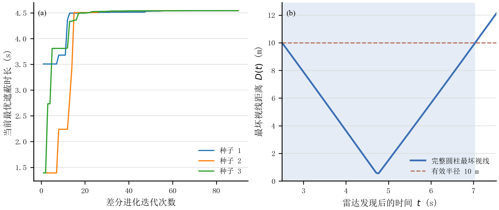

# MathModelingWorkflow

> 面向数学建模竞赛的可复现工作流：从问题拆解、模型建立和数值求解，到科研绘图、DrawIO 流程图、LaTeX 写作与最终验收。


[查看当前论文](paper/main.pdf) · [查看数值结果](reports/RESULTS_REPORT.md) · [查看验收报告](reports/VERIFY_REPORT.md) · [查看任务进度](todo.md)

## 项目简介

本仓库以 2025 年高教社杯全国大学生数学建模竞赛 A 题“烟幕干扰弹的投放策略”为实例，构建了一套可审计、可复现、可逐题验收的数学建模流程。

项目不只保存最终论文，还保留模型分析、求解代码、中间数据、收敛性检验、科研图、DrawIO 源文件与验收报告，使每个结论都能回溯到公式、程序和数据。

## 核心特点

- **逐题推进**：按照问题依赖关系依次完成建模、编码、制图、写作与验收，前一问批准后再进入下一问。
- **严格几何判据**：将真目标保留为完整圆柱体，以全部目标视线的最坏距离判断完全遮蔽，同时给出点目标简化结果用于对照。
- **事件驱动求解**：使用 Brent 法定位遮蔽状态切换时刻，避免固定时间步长带来的边界误差。
- **全局与局部联合优化**：结合多初值差分进化、航向扇区筛查和局部细化，降低陷入局部最优盆地的风险。
- **论文级可视化**：图表由真实计算数据生成，流程图保留可编辑的 DrawIO 源文件，并同步导出论文用 PDF。
- **完整质量检查**：核对数值复现、约束实现、图文一致性、网格收敛、边界扰动和 LaTeX 版式。

## 效果预览



左图展示不同初值与外向航向盆地的优化过程，右图展示最优策略下完整圆柱目标的最坏视线距离及有效遮蔽区间。

## 当前成果

| 子问题 | 任务 | 核心结果 | 状态 |
| --- | --- | --- | --- |
| 问题一 | 给定策略下计算单枚烟幕弹的有效遮蔽时长 | 完整圆柱口径 `1.392 s` | 已批准 |
| 问题二 | 优化 FY1 航向、速度、投放时刻与引信延时 | 最大有效遮蔽时长 `4.588 s` | 待审查 |
| 问题三 | 单机三弹时序优化 | — | 未开始 |
| 问题四 | 三机单弹协同优化 | — | 未开始 |
| 问题五 | 多机、多弹、多目标资源分配 | — | 未开始 |

问题二当前最优策略：航向角 `5.112023°`、飞行速度 `140 m/s`、投放时刻 `0.878620 s`、引信延时 `0.053112 s`，完整遮蔽区间为 `[0.931732, 5.519794] s`。

## 工作流

```text
题目与附件
    ↓
问题拆解与依赖分析
    ↓
数学模型与完整约束
    ↓
代码求解、收敛与敏感性检验
    ↓
科研数据图与 DrawIO 流程图
    ↓
CUMCM LaTeX 正文
    ↓
结果一致性与 PDF 版式验收
```

仓库内置的 Skills 将流程拆分为以下模块：

| Skill | 作用 |
| --- | --- |
| `1start-mathmodel` | 初始化任务、识别子问题并控制逐题审查 |
| `2analysis-modeling` | 建立可编码、可验证的数学模型与完整约束组 |
| `3coding-visual` | 编写求解程序、验证结果并生成科研数据图 |
| `4drawio` | 绘制技术路线图、算法流程图和模型结构图 |
| `5writing` | 使用 CUMCM LaTeX 模板逐题撰写论文 |
| `6verity` | 检查复现性、数值一致性、图表质量和版式 |

## 项目结构

```text
MathModelingWorkflow/
├── .agents/skills/    # 数学建模工作流 Skills 与规范
├── A题/               # 题目及原始附件
├── code/              # 各子问题的 Python 求解程序
├── diagrams/          # DrawIO 源文件与导出图
├── figures/           # 科研数据图（PDF/PNG）
├── paper/             # CUMCM LaTeX 论文工程
├── reports/           # 建模、结果与验收报告
├── results/           # JSON/CSV 数值结果和作图数据
├── plan.md            # 顶层建模计划与统一口径
└── todo.md            # 逐题进度与验收清单
```

## 环境要求

推荐在 **Windows 10/11** 上使用本项目，因为论文和 DrawIO 图指定中文为宋体、英文为 Times New Roman，Windows 的字体兼容性最好。Linux 和 macOS 也可以运行 Python 求解代码，但编译论文前需要自行配置兼容的中文字体。

### 必需软件

| 环境 | 推荐版本或实现 | 用途 | 是否必需 |
| --- | --- | --- | --- |
| Python | Python 3.10 及以上，或 Anaconda/Miniconda | 数值计算、优化与科研绘图 | 必需 |
| Python 包 | `numpy`、`scipy`、`matplotlib` | 当前问题一、二的求解与作图 | 必需 |
| XeLaTeX | MiKTeX 或 TeX Live | 编译 CUMCM 中文论文 | 必需 |
| Draw.io Desktop | 当前稳定版 | 编辑 `.drawio` 并导出 PDF/PNG | 修改流程图时必需 |
| 宋体 | `SimSun` | 论文和流程图中的中文字体 | 必需 |
| Times New Roman | 系统字体或 `paper/fonts/times/` | 英文、数字及西文公式字体 | 必需 |
| Perl | Strawberry Perl 等 | 供 `latexmk` 自动多轮编译 | 可选 |
| Poppler | `pdftoppm`、`pdfinfo` | 将 PDF 渲染为图片并检查版式 | 可选，推荐 |
| Git | Git 2.x | 克隆仓库和版本管理 | 可选 |

> 只想复现数值结果时，安装 Python 与三个 Python 包即可；要重新生成完整论文，需要额外安装 XeLaTeX 和所需字体；要修改流程图，则还需要 Draw.io Desktop。

### Python 环境

建议使用独立虚拟环境，避免与系统 Python 混用：

```powershell
python -m venv .venv
.\.venv\Scripts\Activate.ps1
python -m pip install --upgrade pip
python -m pip install numpy scipy matplotlib
```

如果使用 Anaconda，也可以执行：

```powershell
conda create -n mathmodel python=3.12 numpy scipy matplotlib -y
conda activate mathmodel
```

检查 Python 环境：

```powershell
python --version
python -c "import numpy, scipy, matplotlib; print('Python dependencies: OK')"
```

后续处理 Excel 附件时还需要 `pandas` 和 `openpyxl`，可执行：

```powershell
python -m pip install pandas openpyxl
```

### LaTeX 环境

论文必须使用 **XeLaTeX** 编译，以正确处理中文和系统字体。Windows 推荐安装 MiKTeX，安装后先在 MiKTeX Console 中完成以下操作：

1. 检查并安装 MiKTeX 更新；
2. 刷新文件名数据库和字体映射；
3. 将缺失宏包的安装策略设为询问或自动安装；
4. 确认 MiKTeX 的 `bin/x64` 目录已加入 `PATH`。

检查 LaTeX 环境：

```powershell
xelatex --version
latexmk --version
```

`xelatex` 是必需的；`latexmk` 是可选的。MiKTeX 中的 `latexmk` 依赖 Perl，如果出现 `could not find the script engine 'perl'`，可以安装 Strawberry Perl，也可以直接使用两轮 XeLaTeX 编译，无须安装 Perl。

当前模板主要使用 `ctex`、`fontspec`、`amsmath`、`graphicx`、`booktabs`、`hyperref` 和 `cleveref` 等宏包。MiKTeX 通常会在首次编译时提示安装缺失宏包。

### Draw.io 环境

流程图源文件位于 `diagrams/q1/` 和 `diagrams/q2/`。使用 Draw.io Desktop 打开 `.drawio` 文件即可编辑；论文引用的是同目录导出的 PDF，PNG 用于 GitHub 和人工预览。

导出时保持以下设置：

- 页面裁切到图形内容，背景为白色；
- PDF 用于论文，PNG 用于预览；
- 中文使用宋体，英文和数字使用 Times New Roman；
- 当前竖向流程图源字号为 18 pt，插入论文缩放后约为小四 12 pt；
- 公式变量使用斜体，函数名、数字、括号和单位使用正体。

如果 Draw.io 命令行程序已加入 `PATH`，可以这样重新导出：

```powershell
drawio --export --crop --format pdf --output diagrams/q1/fig_flow_q1.pdf diagrams/q1/fig_flow_q1.drawio
drawio --export --crop --format png --scale 2 --output diagrams/q1/fig_flow_q1.png diagrams/q1/fig_flow_q1.drawio
```

部分 Windows 安装只注册了 `DrawIO.exe` 而没有注册 `drawio` 命令；这种情况下可使用完整的程序路径，或直接在桌面应用中选择“文件 → 导出为”。

### PDF 检查工具（推荐）

项目验收会把论文 PDF 渲染成 PNG 逐页查看。只进行写作并不强制安装，但建议准备 Poppler，并确认以下任一命令可用：

```powershell
pdftoppm -v
pdfinfo -v
```

MiKTeX 通常已经附带这两个工具。也可使用 MuPDF 的 `mutool` 或 ImageMagick 的 `magick` 作为替代。

### 一次性环境自检

```powershell
python --version
python -c "import numpy, scipy, matplotlib; print('Python dependencies: OK')"
xelatex --version
latexmk --version
drawio --version
pdftoppm -v
```

其中 `latexmk`、`drawio` 或 `pdftoppm` 检查失败，不会阻止 Python 数值程序运行；它们分别只影响自动编译、流程图导出和 PDF 视觉验收。

## 快速开始

### 1. 复现问题一

在仓库根目录运行：

```bash
python code/q1_smoke_duration.py
```

结果将写入 `results/q1/`，图片将写入 `figures/q1/`。

### 2. 复现问题二

```bash
python code/q2_single_smoke_optimization.py --maxiter 90 --popsize 11
```

该步骤包含全局搜索、局部细化、边界检查和高密度圆柱轮廓复算，运行时间会明显长于问题一。

### 3. 重新导出 DrawIO 流程图（可选）

修改流程图后，应同时导出 PDF 和 PNG，并将论文使用的 PDF 同步到 `paper/figures/`。例如问题一：

```powershell
drawio --export --crop --format pdf --output diagrams/q1/fig_flow_q1.pdf diagrams/q1/fig_flow_q1.drawio
drawio --export --crop --format png --scale 2 --output diagrams/q1/fig_flow_q1.png diagrams/q1/fig_flow_q1.drawio
Copy-Item diagrams/q1/fig_flow_q1.pdf paper/figures/fig_flow_q1.pdf -Force
```

### 4. 编译论文

进入论文目录后使用 XeLaTeX：

```powershell
cd paper
xelatex -interaction=nonstopmode main.tex; xelatex -interaction=nonstopmode main.tex
```

需要运行两轮，是因为交叉引用、图表编号和页码信息要在第一轮写入辅助文件，再由第二轮回填。若本机已安装 Perl，也可以使用：

```bash
latexmk -xelatex main.tex
```

论文工程的详细说明见 [`paper/README.md`](paper/README.md)。

## 关键输出

- 最终论文：`paper/main.pdf`
- 问题一主结果：`results/q1/summary.json`
- 问题二主结果：`results/q2/summary.json`
- 数值结果汇总：`reports/RESULTS_REPORT.md`
- 验收记录：`reports/VERIFY_REPORT.md`
- 当前任务状态：`todo.md`

## 建模口径

本项目主模型采用完整圆柱目标的保守遮蔽定义：仅当导弹到圆柱目标所有点的有限视线段均与有效烟幕球相交时，才认为目标被完全遮蔽。代码中将投影参数限制在有限线段 `[0,1]`，避免把导弹后方的无限延长线误判为遮蔽。

对于题意可能存在的口径差异，仓库同时保存目标中心点和底面圆心的对照结果，并通过角向网格加密、事件根求解和参数扰动验证结果稳定性。

## 说明

- 本仓库仍在按照逐题审查流程完善，问题三至问题五尚未开始。
- 题目、附件及 CUMCM 模板的著作权归原作者或相关组织所有。
- 本项目用于数学建模学习、研究与工作流实践，请遵守竞赛规则和学术诚信要求。

## 致谢

论文部分基于 [CUMCMThesis](https://github.com/latexstudio/CUMCMThesis) 模板整理，并参考了项目内附带的全国大学生数学建模竞赛论文格式规范。
